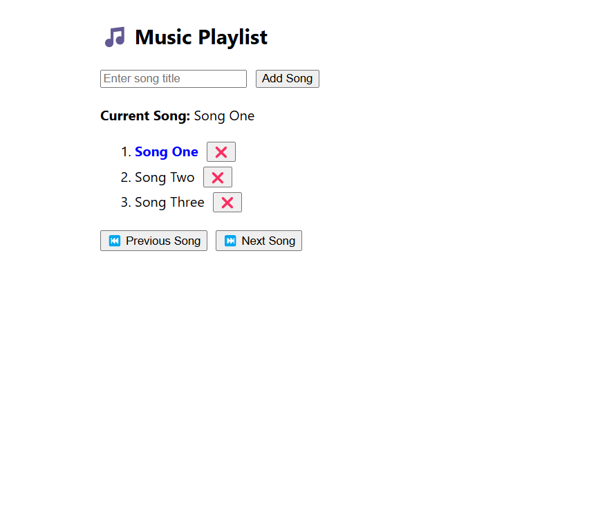

Music Playlist App
A beginner-friendly React-based music playlist application that allows users to:

Add new songs to the playlist
Navigate between songs using Next and Previous buttons with wrap-around logic
Click on any song title to jump directly to it
Remove songs from the playlist dynamically
View which song is currently active

This project is built using React hooks like useState, with clean and simple UI using inline CSS. It's an excellent demonstration of basic state management, list rendering, and user interaction in React.

🔧 Tech Stack
React (Frontend)
JavaScript (ES6)
HTML5 + CSS (Inline styling)

Screenshot 

📦 Features
Feature	Description
Add Song:Type a title and click "Add Song" to append it to the playlist
Next/Previous:Clickable buttons with wrap-around navigation
Jump to Song:Click any song title to set it as the current song
Delete Song	:Remove a song and automatically adjust current selection

git clone https://github.com/hindu17/Music-playlist.git
cd music-playlist-app
npm install
npm start
